## Lucky DDPM 实验指导手册

### 田野采集

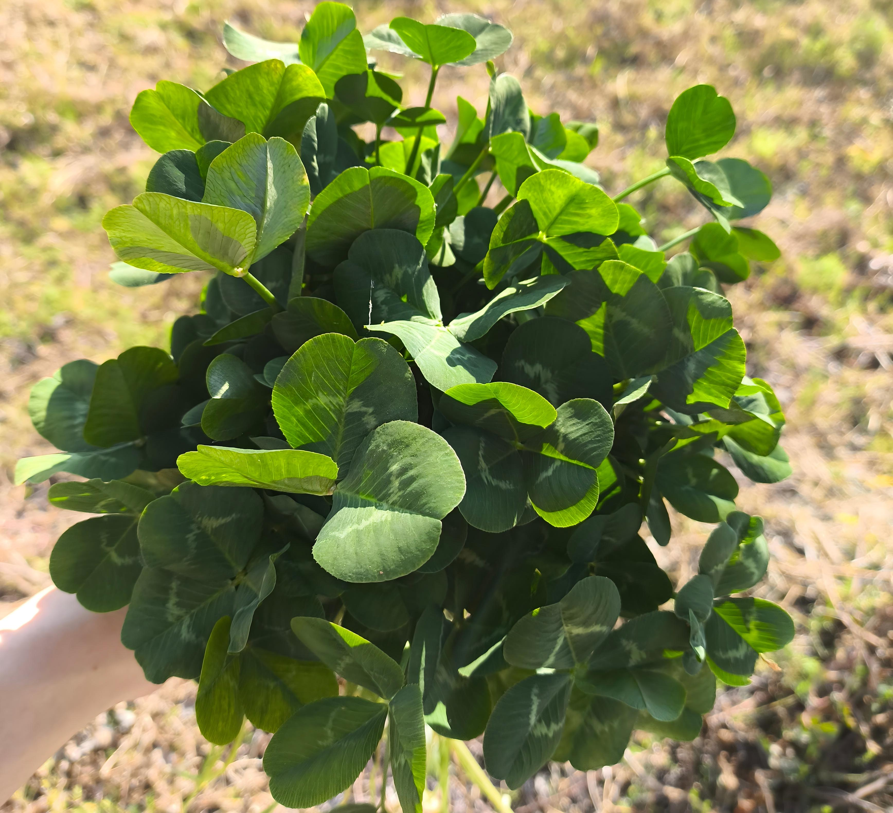

### 书签压扁

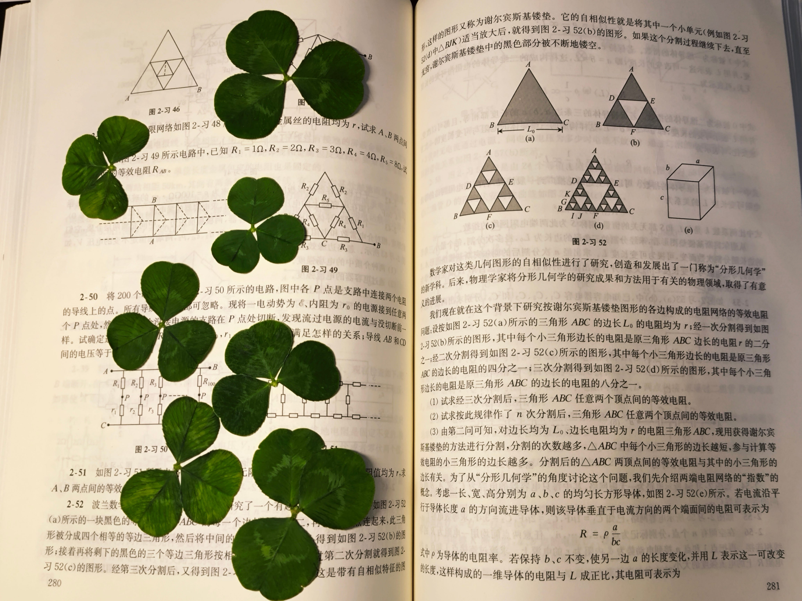

### 拍摄照片

总共挑选了200片形状各异的三叶草，照了17张照片，放在raw文件夹。

前面的16张照片中，一次性拍摄12片三叶草，最后一张照片，拍摄8片三叶草。最后一张照片当中还混入了一个四叶草。

这一步要注意，使用黑色背景，方便之后把背景涂成全黑。


### 实例提取

通过open cv把一张图当中的12片三叶草提取出来，然后把背景涂黑。原来的图像是大约4000×4000像素的，提取之后的像素固定为128×128方便训练（如果想要换尺寸，改一处参数即可）。

原本有17张大图，提取之后有200张小图，200张小图放在data文件夹。

```shell
python extract_instances.py
```

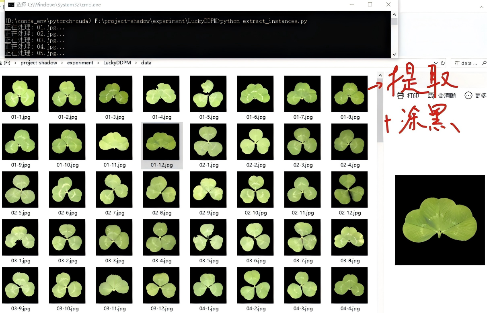

### 数据增强

因为200张图对于训练ddpm模型还是少了，所以对200张小图进行数据增强，通过旋转、翻转和缩放，变成2000张图，放入dataset文件夹。

从图中可以看到意外混入的一片四叶草进行了数据增强，连续生成了10张，由于训练的时候是打乱的，所以不影响。

```shell
python augment.py
```

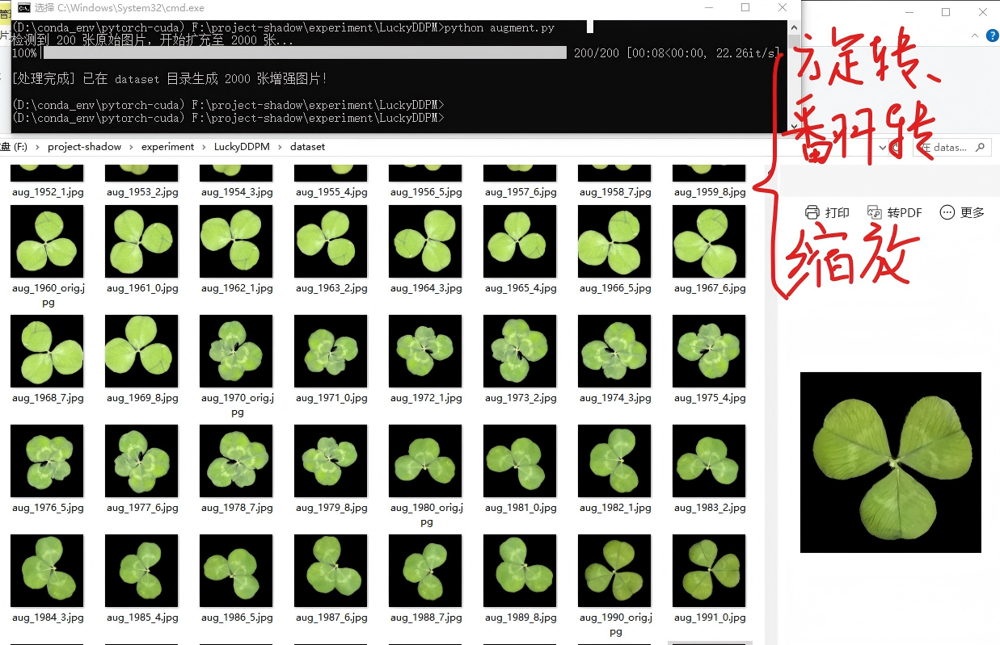

### 租服务器


### 远程登录服务器


### 下载github仓库

先给联网加个速[只在当前端口生效] [服务器不方便配置代理]

```shell
source /etc/network_turbo
```

下载仓库和数据集

```shell
git clone https://github.com/HaiPenglai/Lucky-DDPM
```

### 安装OpenCV

因为没有预装OpenCV，所以需要装一下。否则报错：` No module named 'cv2'`。除此之外，还需要安装`diffusers`（`hugging face`的，类似于`transformers`）。

```shell
pip install opencv-python-headless diffusers accelerate tqdm matplotlib pillow
```

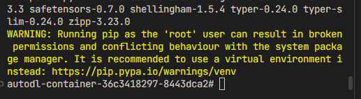

这里可能会有一个提示，就是建议用虚拟环境，而不是在base环境。但是因为在服务器上用完就关了，所以用base环境也无伤大雅，如果自己的环境的话，小心把环境搞乱了，还是要开一个虚拟环境。

### 原地处理数据

因为实例提取和数据增强这两个步骤，几秒钟就能做完，直接从大图原地处理更好。

```shell
python ./extract_instances.py
python ./augment.py
```

### 开始训练

```shell
python ./train.py
```

使用5090的训练速度极快，几乎只需要15秒就可以把2000张图片都训练完(因为我们的图片尺寸不大)，然后会发现损失下降了接近100倍。

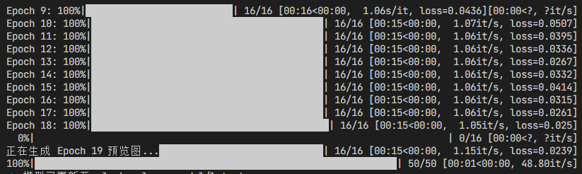

可以看到，每15秒钟就能训练完一轮，也就是2000张图片让模型看一次。总共200轮，一分钟训练4轮，也就是大概50分钟就能全部训练完成。

### 训练监控

每训练10轮，也就是模型把2000张图片走10遍，就会去生成几个样图，同时会保存模型权重。每10轮生成的效果如下：

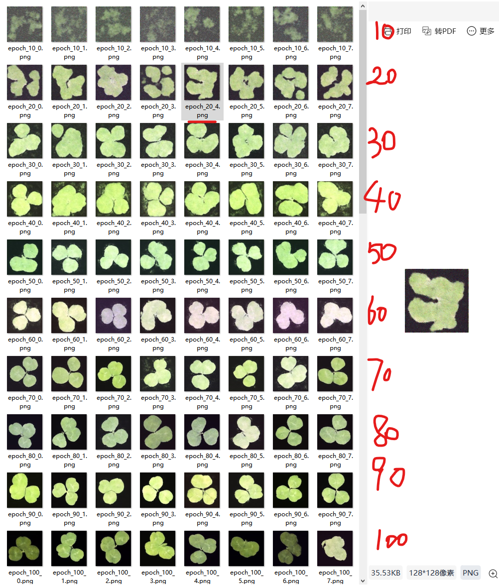

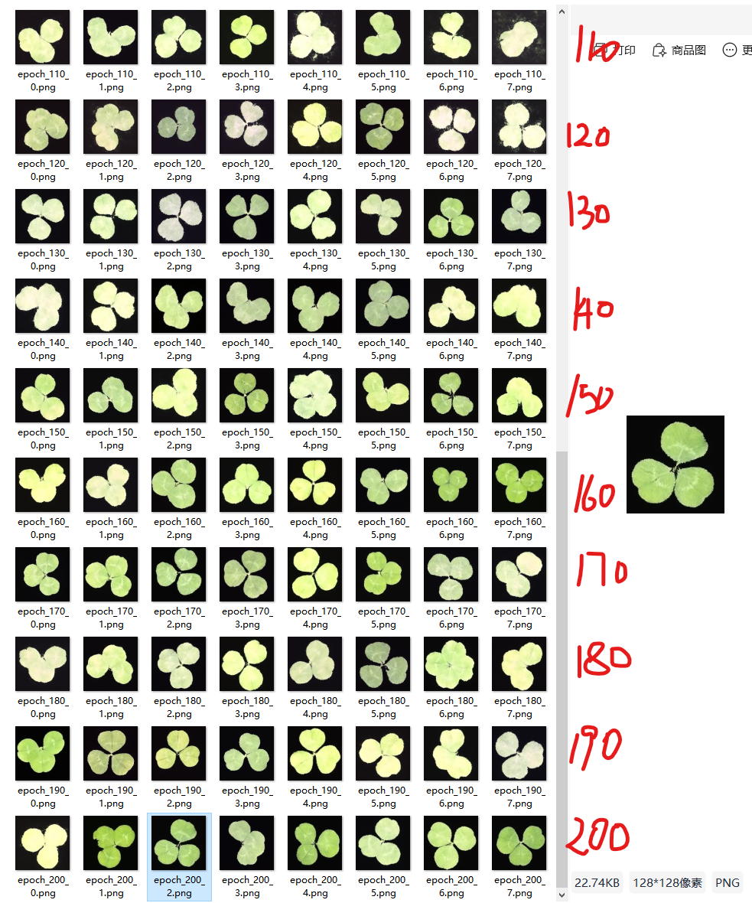

### 生成测试

在generate.py文件中修改模型路径，指向想要测试的模型，例如`lucky_clover_model/checkpoint-epoch-100`。

```shell
python ./generate.py
```

观察发现第100轮的模型生成的效果，甚至比200轮的还要好一些，感觉比较真实。

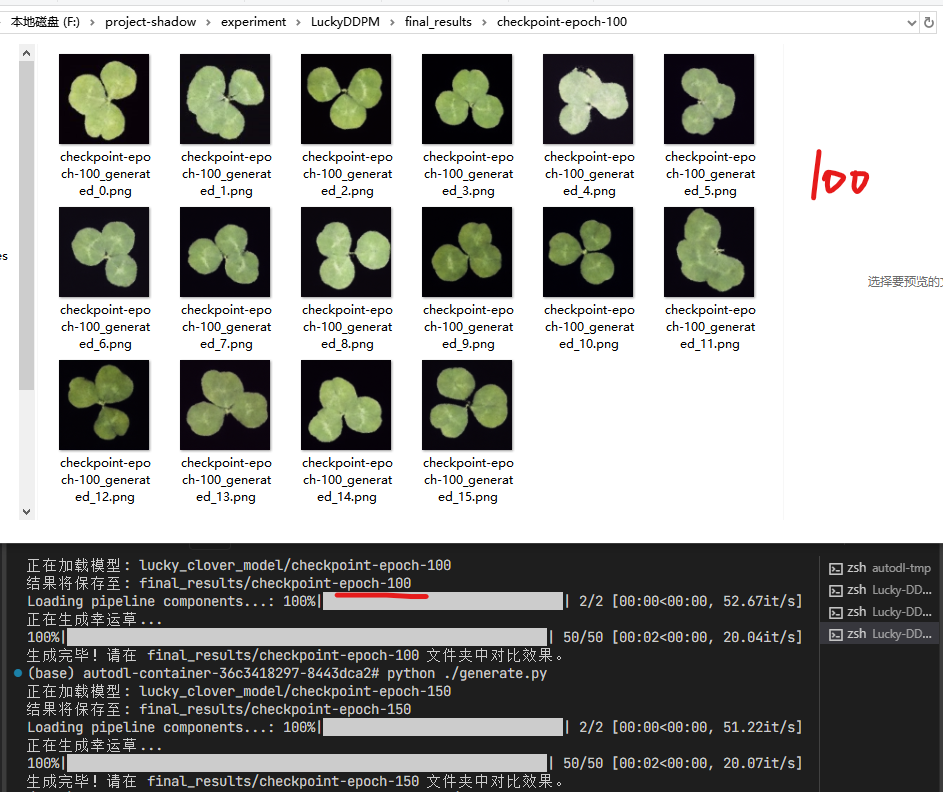

### 模型上传hugging face

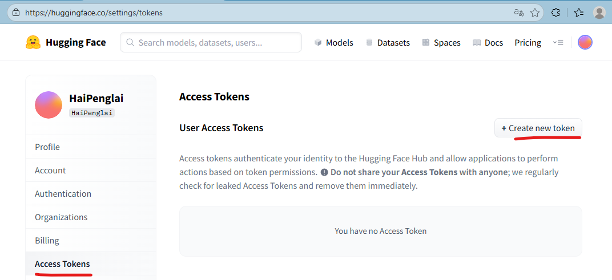


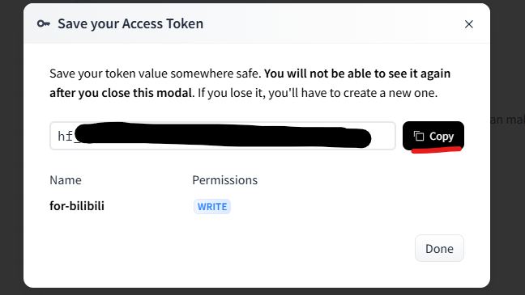

```shell
pip install huggingface_hub
```

写一个简单脚本进行登陆：

```shell
from huggingface_hub import login
# 替换成你自己的那个 hf_... 开头的 Token
login(token="你的_HF_TOKEN_贴在这里")
print("登录成功！")
```

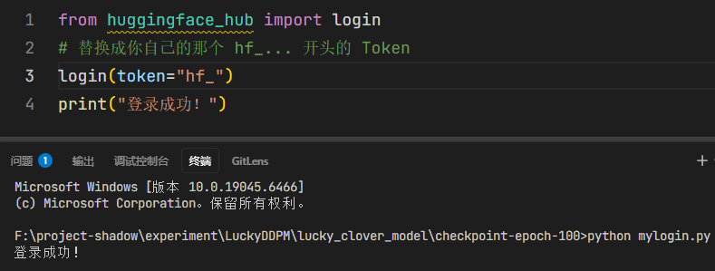

提示：只需要登录一次之后就不再需要这个脚本了，因为电脑会持持久化存储。可以创建多个token，我的这个token在视频结束后就失效了。

之后执行下面的这个脚本就会自动的上传模型，由于我们的模型就是Huggingface格式的，所以不需要修改，直接上传。

```shell
import os
from huggingface_hub import HfApi

# 选择模型
local_model_path = r"F:\project-shadow\experiment\LuckyDDPM\lucky_clover_model\checkpoint-epoch-100"

# Hugging Face 上的仓库名称
repo_name = "Lucky-Clover-DDPM" 

# 用户名
username = "HaiPenglai"

# 完整的仓库 ID
repo_id = f"{username}/{repo_name}"

# 执行上传
api = HfApi()

print(f"正在创建/检查仓库: {repo_id}...")
# 如果仓库不存在，会自动创建；如果存在，则跳过
api.create_repo(repo_id=repo_id, repo_type="model", exist_ok=True)

print(f"正在上传模型文件至 {repo_id}，请稍候...")
# 上传整个文件夹内容
api.upload_folder(
    folder_path=local_model_path,
    repo_id=repo_id,
    repo_type="model",
)

print(f"上传成功！")
print(f"模型主页: https://huggingface.co/{repo_id}")
```

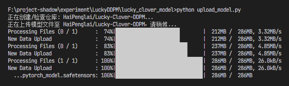

如果想要上传README.md或者是介绍图片也很简单，只需要把upload file当中填入图片文件夹(assets)，还有文件即可。

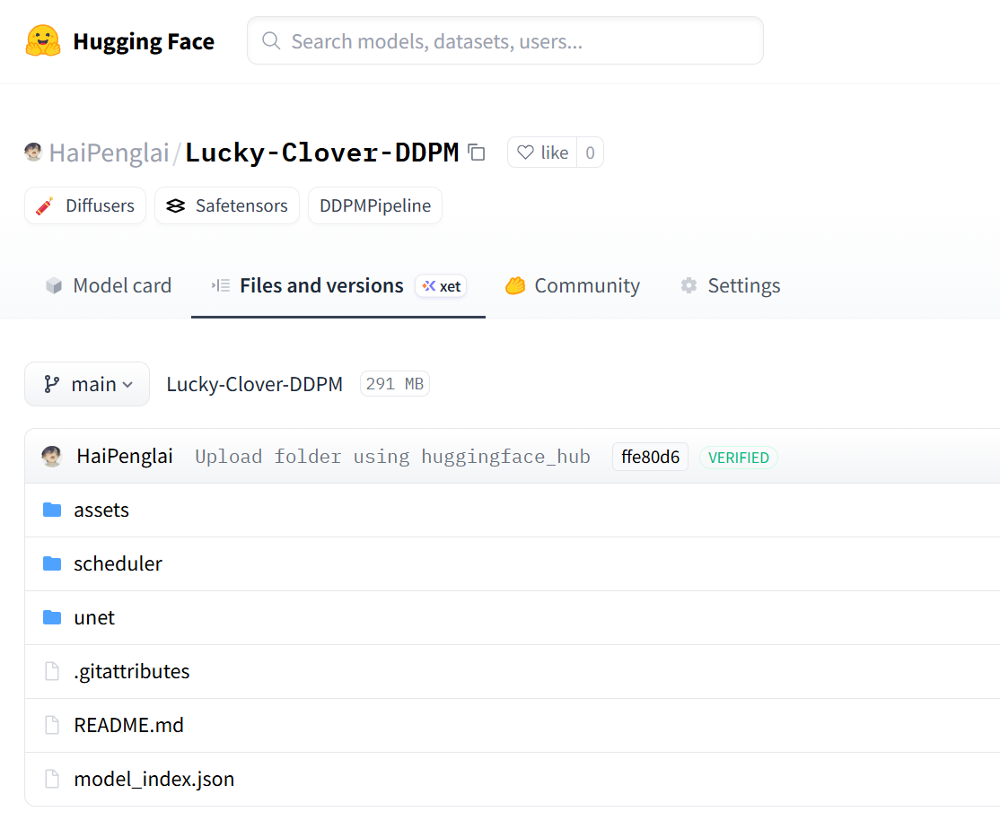

### 数据集上传hugging face

```shell
from huggingface_hub import HfApi
import time

api = HfApi()
repo_id = "HaiPenglai/Lucky-Clover-Dataset"

# 确保仓库存在
api.create_repo(repo_id=repo_id, repo_type="dataset", exist_ok=True)

# 1. 上传 2000 张小图 (这是最容易超时的部分)
print("正在上传训练集 (2000张图片)...")
try:
    api.upload_folder(
        folder_path=r"F:\project-shadow\experiment\LuckyDDPM\dataset",
        path_in_repo="train",
        repo_id=repo_id,
        repo_type="dataset",
        commit_message="Add 2000 augmented images",
    )
    print("训练集上传成功！")
except Exception as e:
    print(f"训练集上传可能超时，但请去网页端确认，可能已经成功了。错误信息: {e}")

# 给服务器一点喘息时间，防止连续 Commit 导致拥堵
time.sleep(5)

# 2. 上传其他小文件夹和文件 (这些通常不会报错)
print("正在上传原图和文档...")

# 512 原图
api.upload_folder(
    folder_path=r"F:\project-shadow\experiment\LuckyDDPM\data", 
    path_in_repo="source_512",
    repo_id=repo_id,
    repo_type="dataset"
)

# 原始大图
api.upload_folder(
    folder_path=r"F:\project-shadow\experiment\LuckyDDPM\raw",
    path_in_repo="raw_full",
    repo_id=repo_id,
    repo_type="dataset"
)

# 说明文档
api.upload_file(
    path_or_fileobj="README.md",
    path_in_repo="README.md",
    repo_id=repo_id,
    repo_type="dataset"
)

# 图片素材
api.upload_folder(
    folder_path="assets",
    path_in_repo="assets",
    repo_id=repo_id,
    repo_type="dataset"
)

print(f"全部任务尝试完成！请访问: https://huggingface.co/datasets/{repo_id}")
```

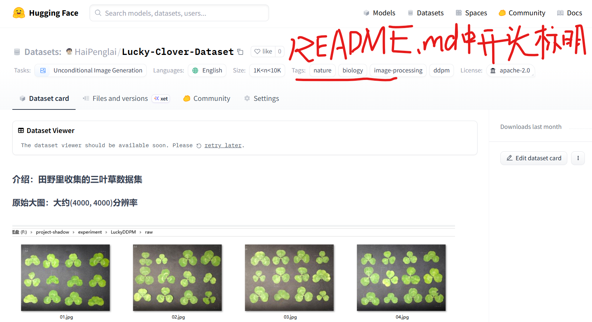

## 附录

### OpenCV幸运草分割遇到的7大坑

- **坑一：全图误判**
  - **问题描述**：脚本运行后，只生成了一张图，包含所有四叶草。
  - **原因**：仅靠亮度（灰度）阈值分割太脆弱。
  - **方案**：利用 `inRange` 只看绿色通道。

- **坑二：非均匀拉伸**
  - **问题描述**：切出来的四叶草看起来“变瘦”或“变扁”了。
  - **原因**：靠近边缘的草在切割时，正方形区域被图片边界截断，导致长宽比失调，再强行缩放到 512x512 时产生拉伸。
  - **方案**：先按原始比例切出草，再将其粘贴到手动构建的纯黑正方形画布中心。

- **坑三：背景噪声**
  - **问题描述**：生成的图片中隐约能看见垫子上的白线、灰尘，或者草周围有一圈暗淡的色块（物理黑与数字黑的边界）。
  - **原因**：相机捕捉的“黑色背景”并非绝对的零（Digital Zero），而是带有纹理和噪点的物理色块，AI会学习这些非结构化噪声。
  - **方案**：利用掩码（Mask）对非绿色区域进行位运算，强制将所有背景像素点抹除为绝对的 `(0, 0, 0)`。

- **坑四：中心阴影残留**
  - **问题描述**：叶片汇聚的中心处经常有难以去除的灰色色块，破坏了草的拓扑美感。
  - **原因**：为了把散开的叶子连起来，使用了过大的卷积核进行闭运算，结果把中间的阴影也“粘”成了草。
  - **方案**：使用大核掩码（50x50）负责“定位”物体边界，使用小核/原色掩码负责“抠图”细节，兼顾完整性与精细度。

- **坑五：三叶草“分家”**
  - **问题描述**：叶片张得比较开的草（如5号草）被切成了 3 张独立的碎叶图，无法作为一个整体。
  - **原因**：连通域检测时卷积核太小，未能跨越叶片间的缝隙，导致一个四叶草被判定为多个独立轮廓。
  - **方案**：在定位阶段执行强力闭运算（Morphology Close），强行将 50 像素内的“孤岛”连成大陆。

- **坑六：叶片内部穿孔（细节损毁）**
  - **问题描述**：处理后的叶片中间出现莫名其妙的黑色小点，像被虫蛀过。
  - **原因**：叶脉深色区域或叶片上的反光被 HSV 过滤误杀，加之去噪用的开运算太重，把内部特征当成背景剔除了。
  - **方案**：在获得叶片外轮廓后，使用 `cv2.drawContours` 的 `-1` 填充参数，直接将轮廓内部全部涂色，从物理上消除所有内部“穿孔”。

- **坑七：黄色叶片被掩码**
  - **问题描述**：处理后的叶片中，黄色区域被错误地掩码了，导致叶面缺叶。
  - **方案**：用取色笔获取了黄色区域的颜色值，据此调整，`mask_raw = cv2.inRange(hsv, np.array([25, 70, 30]), np.array([90, 255, 255]))`之后改善了。

### 模型训练遇到的坑

最主要是来自于一开始尺寸选的太大了，512×512就导致需要10个小时训练，而模型权重的保存的时间隔又太长了，会发现可能训练到60轮效果不错，训练到80轮又不好了。干脆用128×128一个小时之内就能训练完，并且每10轮保存一次，彻底解决这个问题。
